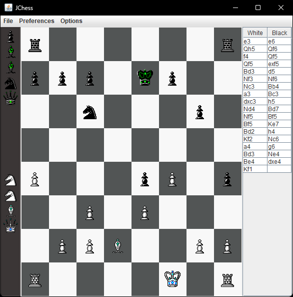

# JChess - Java Chess Engine

This project implements a Chess engine entirely in Java, supporting multiple modes of play:

- **Player vs Player**
- **Player vs AI**
- **AI vs AI**

The engine includes a simple yet effective AI using the Minimax algorithm with a fixed depth search of 4. You can explore the project and the codebase in the `src/` folder.

## Features

- **Game Modes**: Play against another player or challenge the AI in single-player mode. You can also watch AI vs AI matches.
- **Move Highlights**: Toggle the highlighting of valid moves and the current board position.
- **AI Implementation**: The AI uses a Minimax algorithm to evaluate and select optimal moves, providing a challenging opponent.

## Example Gameplay

Here is a snapshot of AI vs AI in action:




As well as the options available to the player:


## AI Algorithm

The AI's decision-making is powered by the Minimax algorithm, with a current search depth of 4. Below is an illustration of the Minimax decision tree used to determine the best move:


For more on Minimax, see this guide on [R-Bloggers](https://www.r-bloggers.com/2022/07/programming-a-simple-minimax-chess-engine-in-r/).

## Prerequisites

To run the chess engine, ensure you have the following installed:
- Java 8 or higher

## Installation

To run the project locally, follow these steps:
1. Clone the repository to your local machine.
2. Navigate to the `src/` directory.
3. Compile and run the Java files using your preferred Java IDE or the command line.

```bash
javac JChess.java
java JChess
```

## Credit
Special thanks to [amir650](https://www.youtube.com/@amir650)  for his Chess Engine guides. You can find his repository and tutorials [here.](https://github.com/amir650/BlackWidow-Chess) Highly recommended for anyone wanting to build a Java-based chess engine or sharpen their Object-Oriented Programming (OOP) skills.
